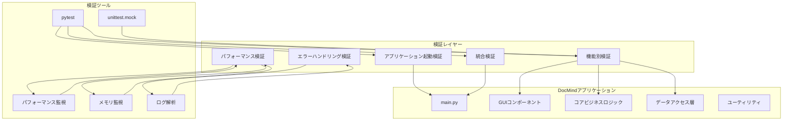
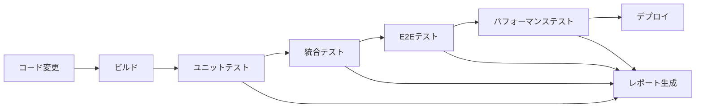

# DocMind全機能動作検証設計書

## 概要

DocMindアプリケーションの全機能について包括的な動作検証を実施するための設計書です。アプリケーションの起動から終了まで、すべての主要機能、エラーハンドリング、パフォーマンス、統合動作を体系的に検証し、本番環境での安定性と信頼性を確保します。

## アーキテクチャ

### 検証フレームワーク構成



### 検証戦略

1. **段階的検証**: 個別コンポーネント → 統合 → エンドツーエンド
2. **自動化検証**: 継続的インテグレーション対応
3. **実環境シミュレーション**: 実際の使用パターンを模倣
4. **パフォーマンス基準**: 定量的な性能要件の検証
5. **エラー注入**: 意図的なエラー発生による堅牢性テスト

## コンポーネント別検証設計

### 1. アプリケーション起動・初期化検証

#### 検証対象
- `main.py`のアプリケーション起動プロセス
- 設定ファイル読み込み
- ログシステム初期化
- データベース初期化
- ディレクトリ構造作成

#### 検証方法

```python
class ApplicationStartupValidator:
    """アプリケーション起動検証クラス"""
    
    def validate_startup_sequence(self):
        """起動シーケンスの検証"""
        # 1. 設定初期化の検証
        # 2. ログシステム初期化の検証
        # 3. データベース初期化の検証
        # 4. ディレクトリ作成の検証
        # 5. GUIコンポーネント初期化の検証
    
    def measure_startup_time(self):
        """起動時間の測定"""
        # 10秒以内の起動要件を検証
    
    def validate_error_recovery(self):
        """起動時エラー回復の検証"""
        # 設定ファイル破損時の回復
        # ディレクトリアクセス権限エラー時の回復
```

#### 検証基準
- 起動時間: 10秒以内
- 必要ディレクトリの自動作成
- 設定ファイル破損時の自動回復
- エラー発生時の適切なメッセージ表示

### 2. ドキュメント処理機能検証

#### 検証対象
- `DocumentProcessor`クラス
- 各ファイル形式の処理（PDF、Word、Excel、テキスト、Markdown）
- テキスト抽出精度
- エンコーディング自動検出

#### 検証方法

```python
class DocumentProcessingValidator:
    """ドキュメント処理検証クラス"""
    
    def validate_file_format_support(self):
        """ファイル形式サポートの検証"""
        # PDF、Word、Excel、テキスト、Markdownの処理
    
    def validate_text_extraction_accuracy(self):
        """テキスト抽出精度の検証"""
        # 既知の内容を持つファイルでの抽出テスト
    
    def validate_encoding_detection(self):
        """エンコーディング検出の検証"""
        # UTF-8、Shift_JIS、EUC-JPなどの検証
    
    def validate_large_file_handling(self):
        """大容量ファイル処理の検証"""
        # メモリ効率とタイムアウト処理
```

#### テストデータセット
- 各形式の標準的なファイル
- 破損ファイル
- 大容量ファイル（100MB以上）
- 異なるエンコーディングのファイル
- 特殊文字を含むファイル

### 3. 検索機能包括検証

#### 検証対象
- `SearchManager`クラス
- 全文検索（Whoosh）
- セマンティック検索（sentence-transformers）
- ハイブリッド検索
- 検索フィルター機能

#### 検証方法

```python
class SearchFunctionalityValidator:
    """検索機能検証クラス"""
    
    def validate_fulltext_search(self):
        """全文検索の検証"""
        # キーワード検索精度
        # ブール演算子サポート
        # ワイルドカード検索
    
    def validate_semantic_search(self):
        """セマンティック検索の検証"""
        # 意味的類似性の検証
        # 多言語対応
        # 同義語検索
    
    def validate_hybrid_search(self):
        """ハイブリッド検索の検証"""
        # 結果統合アルゴリズム
        # スコアリング精度
    
    def validate_search_performance(self):
        """検索パフォーマンスの検証"""
        # 5秒以内の検索要件
        # 大規模データセットでの性能
```

#### パフォーマンス基準
- 検索時間: 5秒以内（50,000ドキュメント）
- 検索精度: 関連度上位90%の適合率
- メモリ使用量: 検索時2GB以下

### 4. GUI機能統合検証

#### 検証対象
- `MainWindow`クラス
- フォルダツリー（`FolderTree`）
- 検索インターフェース（`SearchInterface`）
- 検索結果表示（`SearchResults`）
- ドキュメントプレビュー（`PreviewWidget`）

#### 検証方法

```python
class GUIFunctionalityValidator:
    """GUI機能検証クラス"""
    
    def validate_ui_responsiveness(self):
        """UI応答性の検証"""
        # バックグラウンド処理中の応答性
        # 大量データ表示時の性能
    
    def validate_user_interactions(self):
        """ユーザーインタラクションの検証"""
        # マウス操作
        # キーボードショートカット
        # ドラッグ&ドロップ
    
    def validate_display_accuracy(self):
        """表示精度の検証"""
        # 検索結果の正確な表示
        # プレビューの内容一致
        # 文字化け防止
```

#### 検証環境
- 異なる画面解像度（1920x1080、1366x768、4K）
- 異なるDPI設定
- 異なるOSテーマ

### 5. データ永続化・整合性検証

#### 検証対象
- `DatabaseManager`クラス
- `IndexManager`クラス
- `EmbeddingManager`クラス
- データベーストランザクション
- インデックス整合性

#### 検証方法

```python
class DataPersistenceValidator:
    """データ永続化検証クラス"""
    
    def validate_acid_properties(self):
        """ACID特性の検証"""
        # 原子性、一貫性、独立性、永続性
    
    def validate_data_integrity(self):
        """データ整合性の検証"""
        # 外部キー制約
        # データ型制約
        # 一意性制約
    
    def validate_concurrent_access(self):
        """並行アクセスの検証"""
        # 複数プロセスからの同時アクセス
        # デッドロック防止
    
    def validate_backup_recovery(self):
        """バックアップ・回復の検証"""
        # データベースバックアップ
        # 破損データからの回復
```

### 6. エラーハンドリング・回復機能検証

#### 検証対象
- `ErrorHandler`クラス
- `GracefulDegradation`クラス
- 例外処理機構
- 自動回復機能

#### 検証方法

```python
class ErrorHandlingValidator:
    """エラーハンドリング検証クラス"""
    
    def validate_exception_handling(self):
        """例外処理の検証"""
        # 予期しない例外のキャッチ
        # 適切なエラーメッセージ
        # ログ記録
    
    def validate_graceful_degradation(self):
        """優雅な劣化の検証"""
        # 機能制限モードでの動作
        # 重要機能の継続
    
    def validate_automatic_recovery(self):
        """自動回復の検証"""
        # ネットワーク接続回復
        # ファイルシステムエラー回復
        # メモリ不足からの回復
```

#### エラー注入シナリオ
- ディスク容量不足
- メモリ不足
- ネットワーク切断
- ファイルアクセス権限エラー
- データベース接続エラー

### 7. パフォーマンス・スケーラビリティ検証

#### 検証対象
- 検索パフォーマンス
- インデックス化パフォーマンス
- メモリ使用効率
- CPU使用率
- ディスクI/O効率

#### 検証方法

```python
class PerformanceValidator:
    """パフォーマンス検証クラス"""
    
    def validate_search_performance(self):
        """検索パフォーマンスの検証"""
        # 5秒以内の検索要件
        # 並行検索の性能
    
    def validate_memory_efficiency(self):
        """メモリ効率の検証"""
        # 2GB以下の使用量要件
        # メモリリーク検出
    
    def validate_scalability(self):
        """スケーラビリティの検証"""
        # 線形スケーリング特性
        # 大規模データセット対応
```

#### パフォーマンス基準
- 検索時間: 5秒以内（50,000ドキュメント）
- インデックス化: 30秒以内（1,000ドキュメント）
- メモリ使用量: 2GB以下
- CPU使用率: アイドル時10%以下
- 起動時間: 10秒以内

### 8. セキュリティ・プライバシー検証

#### 検証対象
- ローカルデータ処理
- 外部通信の監視
- ファイルアクセス権限
- 機密データの取り扱い

#### 検証方法

```python
class SecurityValidator:
    """セキュリティ検証クラス"""
    
    def validate_local_processing(self):
        """ローカル処理の検証"""
        # 外部サーバーへの通信なし
        # データの外部送信なし
    
    def validate_file_permissions(self):
        """ファイル権限の検証"""
        # 適切なアクセス権限設定
        # 一時ファイルの安全な削除
    
    def validate_data_encryption(self):
        """データ暗号化の検証"""
        # 機密設定の暗号化
        # メモリ内データの保護
```

## 統合検証設計

### エンドツーエンドワークフロー検証

```python
class EndToEndWorkflowValidator:
    """エンドツーエンドワークフロー検証"""
    
    def validate_complete_workflow(self):
        """完全ワークフローの検証"""
        # 1. アプリケーション起動
        # 2. フォルダ選択
        # 3. ドキュメント処理
        # 4. インデックス化
        # 5. 検索実行
        # 6. 結果表示
        # 7. プレビュー表示
        # 8. アプリケーション終了
    
    def validate_user_scenarios(self):
        """ユーザーシナリオの検証"""
        # 新規ユーザーの初回使用
        # 既存ユーザーの日常使用
        # 大量データの一括処理
        # 長時間の連続使用
```

### 実環境シミュレーション

```python
class RealWorldSimulator:
    """実環境シミュレーター"""
    
    def simulate_typical_usage(self):
        """典型的な使用パターンのシミュレーション"""
        # 1日の使用パターン
        # 週間の使用パターン
        # 月間の使用パターン
    
    def simulate_edge_cases(self):
        """エッジケースのシミュレーション"""
        # 極端に大きなファイル
        # 極端に多いファイル数
        # 特殊な文字を含むファイル名
        # 破損したファイル
```

## テストデータ管理

### テストデータセット設計

```python
class TestDatasetManager:
    """テストデータセット管理"""
    
    def create_standard_dataset(self):
        """標準テストデータセットの作成"""
        # 各ファイル形式の代表的なサンプル
        # 異なるサイズのファイル
        # 異なる言語のコンテンツ
    
    def create_large_dataset(self):
        """大規模テストデータセットの作成"""
        # 50,000ドキュメント
        # 総容量10GB
        # 多様なファイル形式
    
    def create_edge_case_dataset(self):
        """エッジケーステストデータセットの作成"""
        # 破損ファイル
        # 空ファイル
        # 特殊文字ファイル名
        # 極端に大きなファイル
```

### テストデータ生成戦略

1. **合成データ生成**: プログラムによる自動生成
2. **実データサンプリング**: 匿名化された実データの使用
3. **公開データセット**: オープンソースのテストデータ
4. **エッジケース作成**: 意図的な問題データの作成

## 検証結果レポート設計

### レポート構成

```python
class ValidationReportGenerator:
    """検証結果レポート生成"""
    
    def generate_summary_report(self):
        """サマリーレポートの生成"""
        # 全体的な合格/不合格状況
        # 重要な問題の要約
        # パフォーマンス指標
    
    def generate_detailed_report(self):
        """詳細レポートの生成"""
        # 各テストケースの結果
        # エラーログとスタックトレース
        # パフォーマンスグラフ
    
    def generate_trend_analysis(self):
        """トレンド分析レポートの生成"""
        # 過去の検証結果との比較
        # パフォーマンスの推移
        # 品質指標の変化
```

### メトリクス収集

1. **機能メトリクス**: テスト合格率、カバレッジ
2. **パフォーマンスメトリクス**: 応答時間、スループット
3. **品質メトリクス**: バグ密度、信頼性指標
4. **ユーザビリティメトリクス**: 操作性、学習容易性

## 継続的検証戦略

### 自動化パイプライン



### 検証スケジュール

1. **コミット時**: ユニットテスト、基本統合テスト
2. **日次**: 完全な統合テスト、パフォーマンステスト
3. **週次**: エンドツーエンドテスト、セキュリティテスト
4. **リリース前**: 包括的検証、ストレステスト

## 品質ゲート

### 合格基準

1. **機能テスト**: 100%合格
2. **パフォーマンステスト**: 全要件クリア
3. **セキュリティテスト**: 脆弱性なし
4. **ユーザビリティテスト**: 満足度80%以上

### 不合格時の対応

1. **重大な問題**: 即座にリリース停止
2. **軽微な問題**: 修正後に再検証
3. **パフォーマンス問題**: 最適化後に再測定
4. **ユーザビリティ問題**: UI改善後に再評価

## 将来の拡張性

### 検証フレームワークの拡張

1. **新機能対応**: 検証ケースの追加
2. **新技術対応**: 検証ツールの更新
3. **新環境対応**: 検証環境の拡張
4. **新要件対応**: 検証基準の更新

### 継続的改善

1. **検証効率化**: 自動化の拡大
2. **検証精度向上**: より厳密なテスト
3. **検証範囲拡大**: 新しい観点の追加
4. **検証速度向上**: 並列実行の最適化