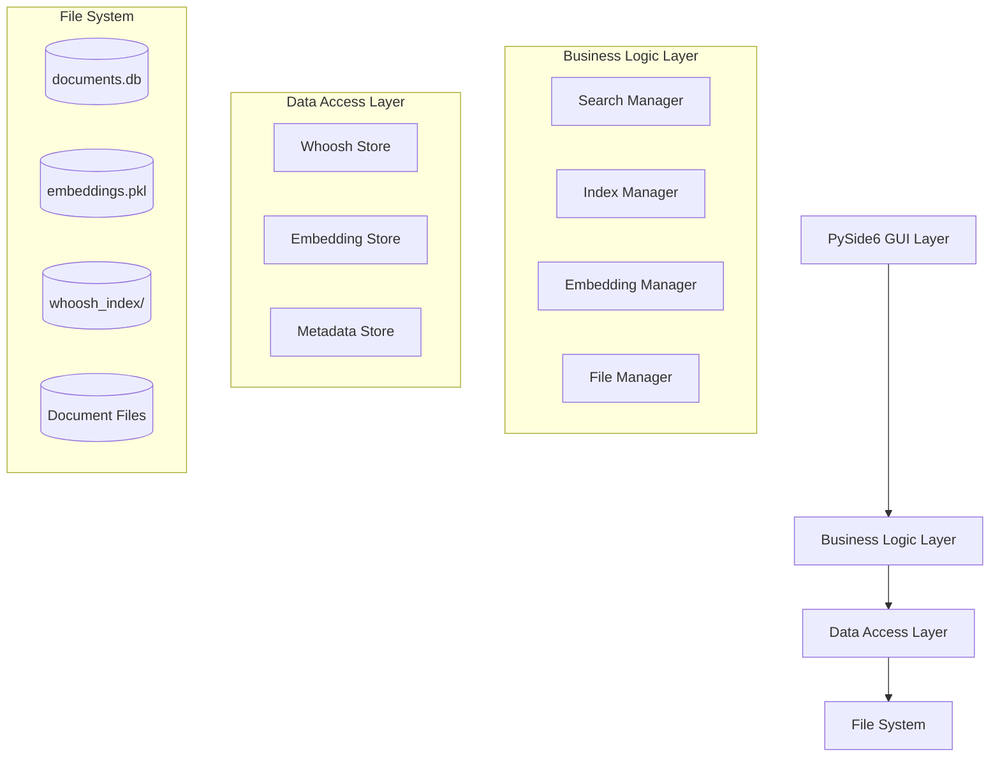

# 設計書

## 概要

DocMindは、Python 3.11+とPySide6で構築されたローカルAI搭載ドキュメント検索アプリケーションです。このシステムは、Whooshを使用した従来の全文検索とsentence-transformersによるセマンティック検索機能を組み合わせ、完全にオフラインで動作します。アーキテクチャは、完全なローカル機能を維持しながら、将来のAPIベースAIサービスをサポートする拡張性を考慮して設計されています。

このアプリケーションは、データアクセス、ビジネスロジック、プレゼンテーション層間の明確な分離を持つモジュラーなレイヤードアーキテクチャに従います。この設計により保守性が確保され、PoCから本番環境への移行時の拡張が容易になります。

## Architecture

### High-Level Architecture



### Component Architecture

The system is organized into the following main components:

1. **GUI Layer**: PySide6-based three-panel interface
2. **Search Engine**: Hybrid search combining full-text and semantic search
3. **Document Processor**: Multi-format document text extraction
4. **Index Manager**: Whoosh-based full-text indexing with incremental updates
5. **Embedding Manager**: Local sentence-transformers for semantic search
6. **Data Storage**: SQLite for metadata, pickle for embeddings, Whoosh for text index

## Components and Interfaces

### Core Classes

#### SearchManager
```python
class SearchManager:
    """Orchestrates hybrid search combining full-text and semantic search"""
    
    def __init__(self, index_manager: IndexManager, embedding_manager: EmbeddingManager)
    def search(self, query: str, search_type: SearchType) -> List[SearchResult]
    def hybrid_search(self, query: str, weights: Dict[str, float]) -> List[SearchResult]
    def get_search_suggestions(self, partial_query: str) -> List[str]
```

#### IndexManager
```python
class IndexManager:
    """Manages Whoosh full-text search index"""
    
    def __init__(self, index_path: str)
    def create_index(self) -> None
    def add_document(self, doc: Document) -> None
    def update_document(self, doc: Document) -> None
    def remove_document(self, doc_id: str) -> None
    def search_text(self, query: str, limit: int = 100) -> List[SearchResult]
    def rebuild_index(self, documents: List[Document]) -> None
```

#### EmbeddingManager
```python
class EmbeddingManager:
    """Manages sentence-transformers embeddings for semantic search"""
    
    def __init__(self, model_name: str = "all-MiniLM-L6-v2")
    def load_model(self) -> None
    def generate_embedding(self, text: str) -> np.ndarray
    def search_similar(self, query_embedding: np.ndarray, limit: int = 100) -> List[SearchResult]
    def add_document_embedding(self, doc_id: str, text: str) -> None
    def save_embeddings(self) -> None
    def load_embeddings(self) -> None
```

#### DocumentProcessor
```python
class DocumentProcessor:
    """Handles text extraction from various file formats"""
    
    def process_file(self, file_path: str) -> Document
    def extract_pdf_text(self, file_path: str) -> str
    def extract_word_text(self, file_path: str) -> str
    def extract_excel_text(self, file_path: str) -> str
    def extract_markdown_text(self, file_path: str) -> str
    def extract_text_file(self, file_path: str) -> str
```

#### FileWatcher
```python
class FileWatcher:
    """Monitors file system changes for incremental indexing"""
    
    def __init__(self, watched_paths: List[str], callback: Callable)
    def start_watching(self) -> None
    def stop_watching(self) -> None
    def on_file_created(self, file_path: str) -> None
    def on_file_modified(self, file_path: str) -> None
    def on_file_deleted(self, file_path: str) -> None
```

### GUI Components

#### MainWindow
```python
class MainWindow(QMainWindow):
    """Main application window with three-panel layout"""
    
    def __init__(self)
    def setup_ui(self) -> None
    def setup_menu_bar(self) -> None
    def setup_status_bar(self) -> None
    def on_search_requested(self, query: str) -> None
    def on_folder_selected(self, path: str) -> None
```

#### FolderTreeWidget
```python
class FolderTreeWidget(QTreeWidget):
    """Left panel folder navigation"""
    
    def __init__(self)
    def load_folder_structure(self, root_path: str) -> None
    def on_folder_selected(self, item: QTreeWidgetItem) -> None
```

#### SearchResultsWidget
```python
class SearchResultsWidget(QListWidget):
    """Center panel search results display"""
    
    def __init__(self)
    def display_results(self, results: List[SearchResult]) -> None
    def create_result_item(self, result: SearchResult) -> QListWidgetItem
    def on_result_selected(self, result: SearchResult) -> None
```

#### PreviewWidget
```python
class PreviewWidget(QTextEdit):
    """Right panel document preview"""
    
    def __init__(self)
    def display_document(self, document: Document) -> None
    def display_summary(self, text: str) -> None
    def highlight_search_terms(self, terms: List[str]) -> None
```

## Data Models

### Core Data Structures

#### Document
```python
@dataclass
class Document:
    id: str
    file_path: str
    title: str
    content: str
    file_type: str
    size: int
    created_date: datetime
    modified_date: datetime
    indexed_date: datetime
    metadata: Dict[str, Any]
```

#### SearchResult
```python
@dataclass
class SearchResult:
    document: Document
    score: float
    search_type: SearchType
    snippet: str
    highlighted_terms: List[str]
    relevance_explanation: str
```

#### SearchType
```python
class SearchType(Enum):
    FULL_TEXT = "full_text"
    SEMANTIC = "semantic"
    HYBRID = "hybrid"
```

### Database Schema

#### documents.db (SQLite)
```sql
CREATE TABLE documents (
    id TEXT PRIMARY KEY,
    file_path TEXT UNIQUE NOT NULL,
    title TEXT NOT NULL,
    file_type TEXT NOT NULL,
    size INTEGER NOT NULL,
    created_date TIMESTAMP NOT NULL,
    modified_date TIMESTAMP NOT NULL,
    indexed_date TIMESTAMP NOT NULL,
    content_hash TEXT NOT NULL,
    metadata TEXT -- JSON string
);

CREATE TABLE search_history (
    id INTEGER PRIMARY KEY AUTOINCREMENT,
    query TEXT NOT NULL,
    search_type TEXT NOT NULL,
    timestamp TIMESTAMP DEFAULT CURRENT_TIMESTAMP,
    result_count INTEGER
);

CREATE INDEX idx_documents_path ON documents(file_path);
CREATE INDEX idx_documents_type ON documents(file_type);
CREATE INDEX idx_documents_modified ON documents(modified_date);
```

### File Storage Structure
```
docmind_data/
├── documents.db           # SQLite database for metadata
├── embeddings.pkl         # Pickled embeddings cache
├── whoosh_index/          # Whoosh full-text search index
│   ├── _MAIN_*.toc
│   ├── _MAIN_*.seg
│   └── ...
├── models/                # Cached sentence-transformers models
│   └── all-MiniLM-L6-v2/
└── logs/                  # Application logs
    └── docmind.log
```

## Error Handling

### Exception Hierarchy
```python
class DocMindException(Exception):
    """Base exception for DocMind application"""
    pass

class DocumentProcessingError(DocMindException):
    """Raised when document processing fails"""
    pass

class IndexingError(DocMindException):
    """Raised when indexing operations fail"""
    pass

class SearchError(DocMindException):
    """Raised when search operations fail"""
    pass

class EmbeddingError(DocMindException):
    """Raised when embedding operations fail"""
    pass
```

### Error Handling Strategy

1. **Graceful Degradation**: If semantic search fails, fall back to full-text search
2. **Partial Processing**: Continue processing other files if one file fails
3. **User Feedback**: Display meaningful error messages in the UI
4. **Logging**: Comprehensive logging for debugging and monitoring
5. **Recovery**: Automatic retry mechanisms for transient failures

### Logging Configuration
```python
import logging

logging.basicConfig(
    level=logging.INFO,
    format='%(asctime)s - %(name)s - %(levelname)s - %(message)s',
    handlers=[
        logging.FileHandler('docmind_data/logs/docmind.log'),
        logging.StreamHandler()
    ]
)
```

## Testing Strategy

### Unit Testing
- **Document Processing**: Test text extraction for each file format
- **Search Functionality**: Test full-text and semantic search accuracy
- **Index Management**: Test incremental indexing and updates
- **Embedding Generation**: Test embedding consistency and similarity calculations

### Integration Testing
- **End-to-End Search**: Test complete search workflow from query to results
- **File System Integration**: Test file watching and incremental updates
- **Database Operations**: Test data persistence and retrieval
- **GUI Integration**: Test UI responsiveness and data flow

### Performance Testing
- **Search Performance**: Verify 5-second search time for 50,000 documents
- **Memory Usage**: Monitor memory consumption during large-scale operations
- **Startup Time**: Ensure application starts within 10 seconds
- **Concurrent Operations**: Test UI responsiveness during background processing

### Test Data Strategy
```python
# Test document collection structure
test_documents/
├── pdfs/           # Sample PDF files of various sizes
├── word_docs/      # Sample Word documents
├── excel_files/    # Sample Excel spreadsheets
├── markdown/       # Sample Markdown files
├── text_files/     # Sample text files
└── mixed/          # Mixed format collection for integration tests
```

## Future Enhancements (PoC → Production)

### API Integration Preparation
1. **Abstract Search Interface**: Create pluggable search providers
2. **Configuration Management**: Support for API keys and endpoints
3. **Hybrid Processing**: Combine local and cloud-based AI processing
4. **Caching Strategy**: Intelligent caching for API responses

### Performance Optimizations
1. **Distributed Processing**: Multi-process document processing
2. **Advanced Caching**: LRU cache for frequently accessed documents
3. **Database Optimization**: Query optimization and indexing strategies
4. **Memory Management**: Streaming processing for large documents

### Enhanced Features
1. **Advanced Search Operators**: Boolean queries, field-specific search
2. **Document Clustering**: Group similar documents automatically
3. **Search Analytics**: Track search patterns and optimize accordingly
4. **Export Functionality**: Export search results and document collections

### Security Enhancements
1. **Data Encryption**: Encrypt sensitive document content
2. **Access Control**: User-based access restrictions
3. **Audit Logging**: Comprehensive audit trail for document access
4. **Privacy Controls**: Configurable data retention policies

### Scalability Improvements
1. **Database Migration**: Move from SQLite to PostgreSQL for larger datasets
2. **Microservices Architecture**: Split into independent services
3. **Container Deployment**: Docker-based deployment strategy
4. **Cloud Integration**: Support for cloud storage backends