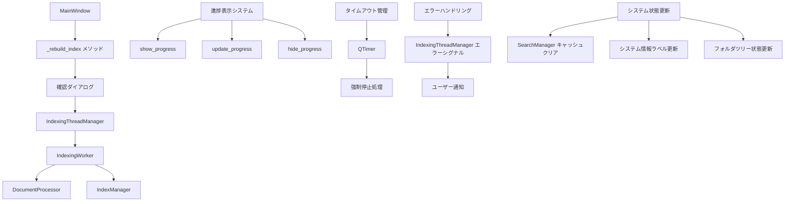
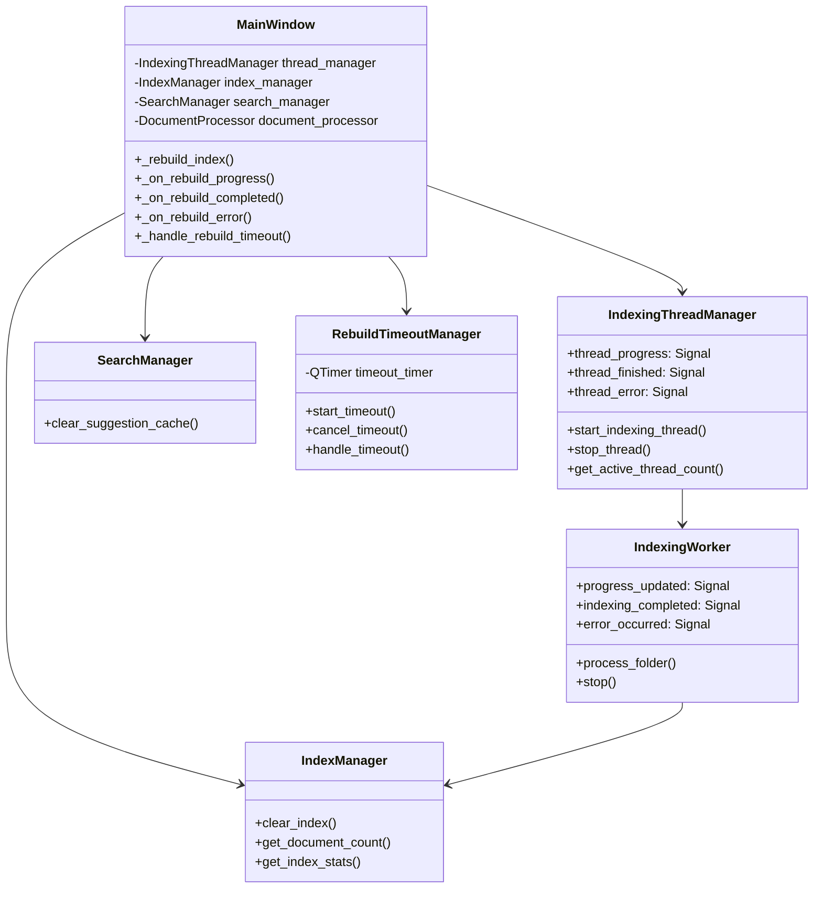
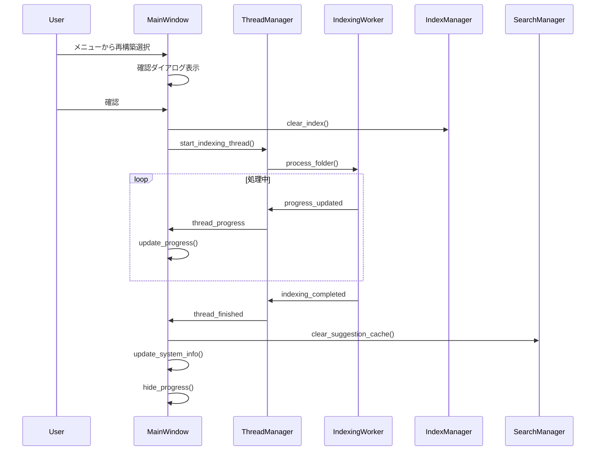
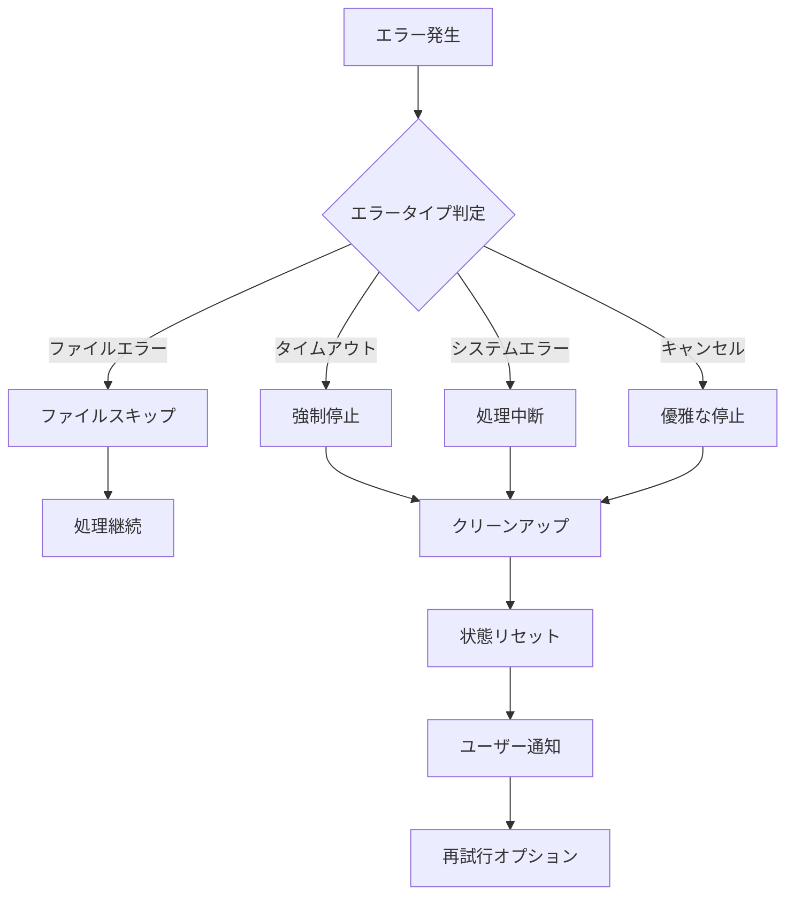

# インデックス再構築機能 設計書

## 概要

DocMindアプリケーションのインデックス再構築機能は、既存の`IndexingWorker`と`IndexingThreadManager`を活用して、ユーザーが手動でインデックスを再構築できる機能を提供します。この機能は、メインウィンドウの`_rebuild_index`メソッドを完全に実装し、バックグラウンドでの非同期処理、進捗表示、エラーハンドリング、タイムアウト処理を含みます。

## アーキテクチャ

### システム構成図



### コンポーネント関係図



## コンポーネント設計

### 1. メインウィンドウ拡張

#### 1.1 _rebuild_index メソッドの実装

```python
def _rebuild_index(self) -> None:
    """インデックス再構築を実行"""
    # 1. 確認ダイアログの表示
    # 2. 現在のフォルダパスの取得
    # 3. 既存インデックスのクリア
    # 4. IndexingThreadManagerを使用した再構築開始
    # 5. タイムアウト管理の開始
    # 6. 進捗表示の開始
```

#### 1.2 進捗管理メソッド

```python
def _on_rebuild_progress(self, thread_id: str, message: str, current: int, total: int) -> None:
    """再構築進捗の更新処理"""

def _on_rebuild_completed(self, thread_id: str, statistics: dict) -> None:
    """再構築完了時の処理"""

def _on_rebuild_error(self, thread_id: str, error_message: str) -> None:
    """再構築エラー時の処理"""
```

#### 1.3 タイムアウト管理

```python
def _setup_rebuild_timeout(self, thread_id: str) -> None:
    """再構築タイムアウトの設定"""

def _handle_rebuild_timeout(self, thread_id: str) -> None:
    """再構築タイムアウト時の処理"""
```

### 2. タイムアウト管理システム

#### 2.1 RebuildTimeoutManager クラス

```python
class RebuildTimeoutManager(QObject):
    """インデックス再構築のタイムアウト管理"""
    
    timeout_occurred = Signal(str)  # thread_id
    
    def __init__(self, timeout_minutes: int = 30):
        self.timeout_minutes = timeout_minutes
        self.active_timers: Dict[str, QTimer] = {}
    
    def start_timeout(self, thread_id: str) -> None:
        """タイムアウト監視を開始"""
    
    def cancel_timeout(self, thread_id: str) -> None:
        """タイムアウト監視をキャンセル"""
    
    def handle_timeout(self, thread_id: str) -> None:
        """タイムアウト発生時の処理"""
```

### 3. 進捗表示システム

#### 3.1 進捗表示の段階

1. **スキャン段階**: "ファイルをスキャン中..."
2. **処理段階**: "処理中: [ファイル名] (X/Y)"
3. **インデックス段階**: "インデックスを作成中..."
4. **完了段階**: "インデックス再構築が完了しました"

#### 3.2 進捗更新パターン

```python
# 不定進捗(スキャン中)
self.show_progress("ファイルをスキャン中...", 0)

# 定進捗(処理中)
self.update_progress(current, total, f"処理中: {filename}")

# 完了
self.hide_progress("インデックス再構築が完了しました")
```

### 4. エラーハンドリング設計

#### 4.1 エラー分類と対応

| エラータイプ | 対応方法 | ユーザー通知 |
|-------------|----------|-------------|
| ファイルアクセスエラー | スキップして継続 | 警告ダイアログ |
| インデックス作成エラー | 処理中断、クリーンアップ | エラーダイアログ |
| タイムアウトエラー | 強制停止、クリーンアップ | タイムアウトダイアログ |
| システムエラー | 処理中断、状態復旧 | エラーダイアログ |

#### 4.2 エラー回復処理

```python
def _handle_rebuild_failure(self, thread_id: str, error_type: str, error_message: str) -> None:
    """再構築失敗時の回復処理"""
    # 1. 進行中の処理を停止
    # 2. 部分的なインデックスをクリア
    # 3. システム状態をリセット
    # 4. ユーザーに通知
    # 5. 再試行オプションを提供
```

### 5. システム状態管理

#### 5.1 状態更新フロー



#### 5.2 状態更新項目

1. **進捗バー**: 処理状況の視覚的表示
2. **ステータスラベル**: 現在の処理内容
3. **システム情報ラベル**: インデックス状態
4. **検索キャッシュ**: 提案キャッシュのクリア
5. **フォルダツリー**: インデックス状態表示

## データモデル

### 1. 再構築状態管理

```python
@dataclass
class RebuildState:
    """インデックス再構築の状態管理"""
    thread_id: Optional[str] = None
    start_time: Optional[datetime] = None
    folder_path: Optional[str] = None
    is_active: bool = False
    timeout_timer: Optional[QTimer] = None
    
    def is_timeout_exceeded(self, timeout_minutes: int = 30) -> bool:
        """タイムアウトを超過しているかチェック"""
        if not self.start_time:
            return False
        elapsed = datetime.now() - self.start_time
        return elapsed.total_seconds() > (timeout_minutes * 60)
```

### 2. 進捗情報

```python
@dataclass
class RebuildProgress:
    """再構築進捗情報"""
    stage: str  # "scanning", "processing", "indexing", "completed"
    current_file: str
    files_processed: int
    total_files: int
    percentage: int
    message: str
    
    def get_display_message(self) -> str:
        """表示用メッセージを生成"""
        if self.stage == "scanning":
            return f"ファイルをスキャン中... ({self.total_files}個発見)"
        elif self.stage == "processing":
            return f"処理中: {os.path.basename(self.current_file)} ({self.files_processed}/{self.total_files})"
        elif self.stage == "indexing":
            return f"インデックスを作成中... ({self.files_processed}ファイル処理済み)"
        else:
            return self.message
```

## インターフェース設計

### 1. シグナル接続

```python
def _connect_rebuild_signals(self) -> None:
    """再構築関連のシグナルを接続"""
    # ThreadManagerのシグナル
    self.thread_manager.thread_progress.connect(self._on_rebuild_progress)
    self.thread_manager.thread_finished.connect(self._on_rebuild_completed)
    self.thread_manager.thread_error.connect(self._on_rebuild_error)
    
    # タイムアウトマネージャーのシグナル
    self.timeout_manager.timeout_occurred.connect(self._handle_rebuild_timeout)
```

### 2. ユーザーインターフェース

#### 2.1 確認ダイアログ

```python
def _show_rebuild_confirmation_dialog(self) -> bool:
    """再構築確認ダイアログを表示"""
    reply = QMessageBox.question(
        self,
        "インデックス再構築",
        "インデックスを再構築しますか？\n\n"
        "この操作により、既存のインデックスが削除され、\n"
        "すべてのドキュメントが再度処理されます。\n"
        "処理には時間がかかる場合があります。\n\n"
        "続行しますか？",
        QMessageBox.Yes | QMessageBox.No,
        QMessageBox.No
    )
    return reply == QMessageBox.Yes
```

#### 2.2 タイムアウトダイアログ

```python
def _show_timeout_dialog(self, thread_id: str) -> None:
    """タイムアウトダイアログを表示"""
    reply = QMessageBox.warning(
        self,
        "処理タイムアウト",
        "インデックス再構築が長時間応答していません。\n\n"
        "処理を中断しますか？",
        QMessageBox.Yes | QMessageBox.No,
        QMessageBox.Yes
    )
    
    if reply == QMessageBox.Yes:
        self._force_stop_rebuild(thread_id)
```

## エラーハンドリング

### 1. エラー分類

```python
class RebuildError(Exception):
    """インデックス再構築エラーの基底クラス"""
    pass

class RebuildTimeoutError(RebuildError):
    """再構築タイムアウトエラー"""
    pass

class RebuildCancellationError(RebuildError):
    """再構築キャンセルエラー"""
    pass

class RebuildSystemError(RebuildError):
    """再構築システムエラー"""
    pass
```

### 2. エラー処理フロー



## テスト戦略

### 1. 単体テスト

- `_rebuild_index`メソッドの動作確認
- タイムアウト管理の動作確認
- エラーハンドリングの動作確認
- 進捗表示の動作確認

### 2. 統合テスト

- IndexingThreadManagerとの連携確認
- IndexingWorkerとの連携確認
- UI更新の確認
- エラー回復処理の確認

### 3. パフォーマンステスト

- 大量ファイル処理時の動作確認
- メモリ使用量の確認
- タイムアウト処理の確認

## セキュリティ考慮事項

### 1. ファイルアクセス制御

- 読み取り専用ファイルの適切な処理
- アクセス権限エラーの適切な処理
- パスインジェクション攻撃の防止

### 2. リソース管理

- メモリリークの防止
- ファイルハンドルリークの防止
- スレッドリークの防止

### 3. エラー情報の適切な処理

- 機密情報の漏洩防止
- エラーログの適切な管理
- ユーザー向けエラーメッセージの安全性

## パフォーマンス最適化

### 1. バッチ処理

- ドキュメントのバッチ処理による効率化
- インデックス更新の最適化
- メモリ使用量の制御

### 2. 進捗更新の最適化

- 進捗更新頻度の調整
- UI更新のスロットリング
- 不要な再描画の防止

### 3. タイムアウト管理の最適化

- 適切なタイムアウト値の設定
- 定期的な応答性チェック
- 効率的な強制停止処理