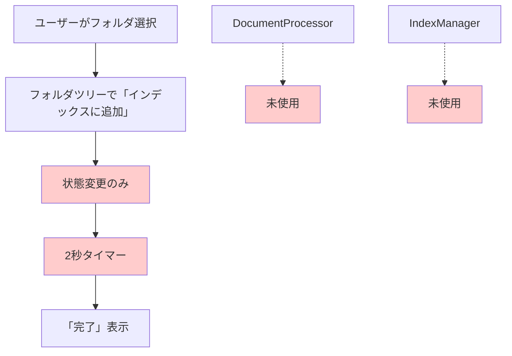
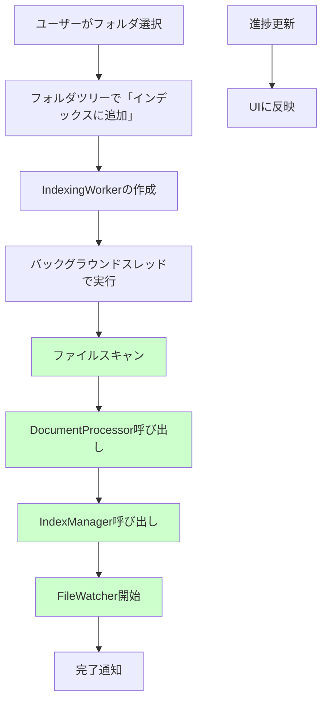
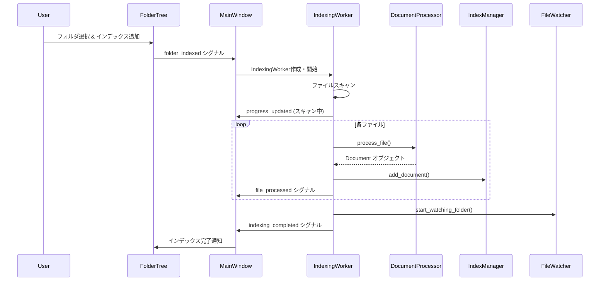
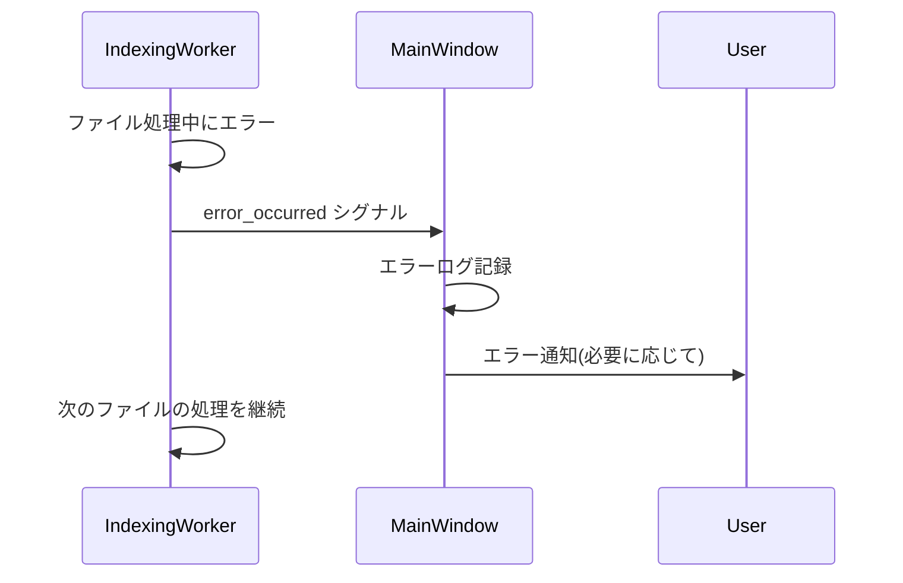

# 実際のインデックス処理実装 - 設計文書

## 概要

現在のDocMindアプリケーションは、フォルダインデックス機能において「見た目だけ」の実装となっており、実際のファイル処理、ドキュメント解析、インデックス作成が行われていません。この設計文書では、既存のDocumentProcessorとIndexManagerを活用して、実際のインデックス処理を実装するためのアーキテクチャを定義します。

## アーキテクチャ

### 現在の問題点



### 新しいアーキテクチャ



## コンポーネント設計

### 1. IndexingWorker(新規作成)

**責務**: フォルダのインデックス処理を非同期で実行

```python
class IndexingWorker(QObject):
    """フォルダインデックス処理を非同期で実行するワーカー"""

    # シグナル
    progress_updated = Signal(str, int, int)  # message, current, total
    file_processed = Signal(str, bool)       # file_path, success
    indexing_completed = Signal(str, dict)   # folder_path, stats
    error_occurred = Signal(str, str)        # file_path, error_message

    def __init__(self, folder_path: str, document_processor: DocumentProcessor,
                 index_manager: IndexManager):
        super().__init__()
        self.folder_path = folder_path
        self.document_processor = document_processor
        self.index_manager = index_manager
        self.should_stop = False

    def process_folder(self):
        """フォルダ処理のメインロジック"""
        # 1. ファイルスキャン
        # 2. 各ファイルの処理
        # 3. インデックス追加
        # 4. 統計情報の収集
```

**主要メソッド**:
- `process_folder()`: メイン処理ロジック
- `scan_files()`: サポートされているファイルをスキャン
- `process_single_file()`: 単一ファイルの処理
- `stop()`: 処理の停止

### 2. MainWindow(修正)

**修正点**: `_on_folder_indexed`メソッドで実際のインデックス処理を開始

```python
def _on_folder_indexed(self, folder_path: str) -> None:
    """フォルダがインデックスに追加された時の処理"""
    # プレースホルダーを削除し、実際の処理を実装
    self._start_indexing_process(folder_path)

def _start_indexing_process(self, folder_path: str):
    """実際のインデックス処理を開始"""
    # IndexingWorkerを作成してバックグラウンドで実行
    worker = IndexingWorker(folder_path, self.document_processor, self.index_manager)
    # シグナル接続と実行
```

### 3. FolderTreeWidget(修正)

**修正点**: インデックス状態の管理を改善

```python
def _index_folder(self):
    """フォルダをインデックスに追加"""
    # 現在の状態変更に加えて、処理状態の管理を追加
    current_item.item_type = FolderItemType.INDEXING  # 新しい状態
    self.folder_indexed.emit(folder_path)
```

### 4. FileWatcherIntegration(新規作成)

**責務**: インデックス化されたフォルダの監視を管理

```python
class FileWatcherIntegration:
    """ファイル監視の統合管理"""

    def start_watching_folder(self, folder_path: str):
        """フォルダの監視を開始"""

    def stop_watching_folder(self, folder_path: str):
        """フォルダの監視を停止"""

    def handle_file_change(self, file_path: str, change_type: str):
        """ファイル変更の処理"""
```

## データフロー

### インデックス作成フロー



### エラーハンドリングフロー



## インターフェース設計

### 1. IndexingWorker インターフェース

```python
class IndexingWorker(QObject):
    # シグナル定義
    progress_updated = Signal(str, int, int)    # message, current, total
    file_processed = Signal(str, bool, str)     # file_path, success, error_msg
    indexing_completed = Signal(str, dict)      # folder_path, statistics
    error_occurred = Signal(str, str)           # context, error_message

    def __init__(self, folder_path: str, document_processor: DocumentProcessor,
                 index_manager: IndexManager, file_watcher: FileWatcher):
        pass

    def process_folder(self) -> None:
        """フォルダ処理を開始"""
        pass

    def stop(self) -> None:
        """処理を停止"""
        pass
```

### 2. 統計情報データ構造

```python
@dataclass
class IndexingStatistics:
    """インデックス処理の統計情報"""
    folder_path: str
    total_files_found: int
    files_processed: int
    files_failed: int
    documents_added: int
    processing_time: float
    errors: List[str]

    def to_dict(self) -> dict:
        """辞書形式に変換"""
        return asdict(self)
```

### 3. 進捗情報データ構造

```python
@dataclass
class IndexingProgress:
    """インデックス処理の進捗情報"""
    stage: str              # "scanning", "processing", "indexing", "watching"
    current_file: str       # 現在処理中のファイル
    files_processed: int    # 処理済みファイル数
    total_files: int        # 総ファイル数
    percentage: int         # 進捗率(0-100)

    def get_message(self) -> str:
        """進捗メッセージを生成"""
        if self.stage == "scanning":
            return "ファイルをスキャン中..."
        elif self.stage == "processing":
            return f"処理中: {os.path.basename(self.current_file)} ({self.files_processed}/{self.total_files})"
        elif self.stage == "indexing":
            return "インデックスを作成中..."
        elif self.stage == "watching":
            return "ファイル監視を開始中..."
        else:
            return "処理中..."
```

## エラーハンドリング戦略

### 1. ファイルレベルエラー

- **戦略**: 個別ファイルのエラーは記録して処理を継続
- **実装**: try-catch でファイル処理をラップ
- **ログ**: エラーファイルのリストを統計情報に含める

### 2. システムレベルエラー

- **戦略**: 重大なエラーは処理を停止してユーザーに通知
- **実装**: IndexingWorker レベルでの例外ハンドリング
- **回復**: 部分的に作成されたインデックスのクリーンアップ

### 3. リソース不足エラー

- **戦略**: メモリ不足時はバッチサイズを調整
- **実装**: 動的なバッチサイズ調整機能
- **監視**: メモリ使用量の監視

## パフォーマンス最適化

### 1. バッチ処理

```python
class BatchProcessor:
    """ドキュメントのバッチ処理"""

    def __init__(self, batch_size: int = 50):
        self.batch_size = batch_size
        self.current_batch = []

    def add_document(self, document: Document):
        """ドキュメントをバッチに追加"""
        self.current_batch.append(document)
        if len(self.current_batch) >= self.batch_size:
            self.flush_batch()

    def flush_batch(self):
        """バッチを処理"""
        # IndexManager に一括追加
        pass
```

### 2. メモリ管理

- **大きなファイルの処理**: ストリーミング処理
- **メモリ監視**: 定期的なガベージコレクション
- **キャッシュ制限**: DocumentProcessor のキャッシュサイズ制限

### 3. 並行処理制限

- **スレッド数制限**: CPU コア数に基づく制限
- **I/O 制限**: 同時ファイルアクセス数の制限
- **優先度制御**: UI応答性を優先

## テスト戦略

### 1. 単体テスト

- **IndexingWorker**: モックを使用したテスト
- **BatchProcessor**: バッチ処理ロジックのテスト
- **エラーハンドリング**: 各種エラーケースのテスト

### 2. 統合テスト

- **エンドツーエンド**: フォルダ選択からインデックス完了まで
- **大量ファイル**: パフォーマンステスト
- **エラー回復**: エラー発生時の回復テスト

### 3. UI テスト

- **進捗表示**: 進捗バーとメッセージの更新
- **キャンセル機能**: 処理中断のテスト
- **エラー表示**: エラーダイアログの表示テスト

## セキュリティ考慮事項

### 1. ファイルアクセス制御

- **権限チェック**: ファイル読み取り権限の確認
- **パストラバーサル**: 安全なパス処理
- **シンボリックリンク**: 安全なリンク処理

### 2. リソース制限

- **メモリ制限**: 最大メモリ使用量の制限
- **ファイルサイズ制限**: 処理可能な最大ファイルサイズ
- **処理時間制限**: タイムアウト機能

### 3. データ検証

- **ファイル形式検証**: 拡張子とMIMEタイプの確認
- **コンテンツ検証**: 悪意のあるコンテンツの検出
- **エンコーディング検証**: 安全なエンコーディング処理
