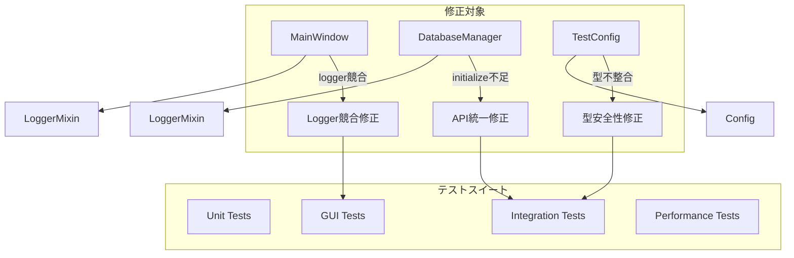

# テスト修正設計書

## 概要

DocMindアプリケーションのテストスイートで発見された問題を修正するための設計書です。主にMainWindowクラスのloggerプロパティ競合、DatabaseManagerクラスのAPIインターフェース不整合、テスト設定の型不整合を解決します。修正は既存機能の後方互換性を維持しながら、テストの安定性と信頼性を向上させることを目的とします。

## アーキテクチャ

### 修正対象コンポーネント



### 修正戦略

1. **最小限の変更**: 既存機能を破損させない最小限の修正
2. **後方互換性**: 既存のAPIと動作を維持
3. **型安全性**: 一貫した型システムの実装
4. **テスト安定性**: 偽陽性・偽陰性の排除

## コンポーネントと修正内容

### 1. MainWindowクラスのlogger競合修正

#### 問題分析
- `MainWindow`は`LoggerMixin`を継承している
- `LoggerMixin`は`logger`を読み取り専用プロパティとして定義
- `MainWindow.__init__()`で`self.logger = logging.getLogger(__name__)`を実行
- プロパティセッターが存在しないため`AttributeError`が発生

#### 修正設計

```python
class MainWindow(QMainWindow, LoggerMixin):
    """
    DocMindのメインアプリケーションウィンドウ
    
    LoggerMixinのloggerプロパティを使用し、
    直接的なlogger設定は行わない。
    """
    
    def __init__(self, parent: Optional[QWidget] = None):
        """
        メインウィンドウの初期化
        
        Args:
            parent: 親ウィジェット(通常はNone)
        """
        super().__init__(parent)
        
        # LoggerMixinのloggerプロパティを使用
        # self.logger = logging.getLogger(__name__)  # 削除
        
        self.config = Config()
        
        # 以降の処理は変更なし
        self._setup_window()
        # ...
```

#### 影響範囲
- `src/gui/main_window.py`の1行のみ修正
- 既存のログ出力は`self.logger`プロパティ経由で継続動作
- LoggerMixinが適切なロガー名を自動生成

### 2. DatabaseManagerクラスのAPI統一修正

#### 問題分析
- テストコードは`DatabaseManager.initialize()`メソッドを期待
- 実装では`_initialize_database()`が`__init__`内で自動実行
- 公開APIとして`initialize()`メソッドが存在しない

#### 修正設計

```python
class DatabaseManager(LoggerMixin):
    """SQLiteデータベースの管理を行うクラス"""
    
    def __init__(self, db_path: str, pool_size: int = 10):
        """DatabaseManagerを初期化"""
        self.db_path = Path(db_path)
        self.db_path.parent.mkdir(parents=True, exist_ok=True)
        
        self._connection_pool = ConnectionPool(str(self.db_path), pool_size)
        self._query_cache: Dict[str, Any] = {}
        self._cache_lock = threading.RLock()
        self._cache_ttl = 300
        
        self._query_stats = {
            "total_queries": 0,
            "cache_hits": 0,
            "cache_misses": 0,
            "avg_query_time": 0.0
        }
        self._stats_lock = threading.Lock()
        
        # 初期化フラグ
        self._initialized = False
        
        # 自動初期化(既存動作を維持)
        self.initialize()
    
    def initialize(self) -> None:
        """
        データベースの初期化
        
        冪等性を保証し、複数回呼び出しても安全。
        テストでの明示的な初期化呼び出しをサポート。
        """
        if self._initialized:
            self.logger.debug("データベースは既に初期化済みです")
            return
        
        self._initialize_database()
        self._initialized = True
        self.logger.info("データベースが初期化されました")
    
    def _initialize_database(self):
        """内部的なデータベース初期化処理(既存実装を維持)"""
        # 既存の実装をそのまま維持
        pass
```

#### 影響範囲
- `src/data/database.py`に`initialize()`メソッドを追加
- 既存の`_initialize_database()`実装は変更なし
- 既存の自動初期化動作は維持
- テストでの明示的な`initialize()`呼び出しをサポート

### 3. テスト設定の型安全性修正

#### 問題分析
- テストで`test_config.data_dir.exists()`を呼び出し
- `Config.data_dir`が文字列を返すが、テストはPathオブジェクトを期待
- 型の不整合により`AttributeError`が発生

#### 修正設計

```python
class Config:
    """アプリケーション設定管理クラス"""
    
    @property
    def data_dir(self) -> Path:
        """
        データディレクトリのパスを取得
        
        Returns:
            Pathオブジェクト(文字列ではなく)
        """
        return Path(self._data_directory)
    
    def get_data_directory(self) -> str:
        """
        データディレクトリのパスを文字列で取得
        
        既存のAPIとの互換性を維持
        
        Returns:
            データディレクトリのパス(文字列)
        """
        return self._data_directory
```

#### 影響範囲
- `src/utils/config.py`の`data_dir`プロパティの型を修正
- 既存の`get_data_directory()`メソッドは文字列を返すため互換性維持
- テストコードは修正不要(適切な型が返される)

### 4. テストスイート安定性向上

#### テスト修正戦略

1. **モック改善**: GUIテストでの適切なモック設定
2. **セットアップ改善**: テストフィクスチャの初期化順序最適化
3. **エラーハンドリング**: テスト失敗時の詳細情報提供
4. **並行実行**: テスト間の依存関係排除

#### テストフィクスチャ改善

```python
@pytest.fixture
def test_config():
    """テスト用設定オブジェクト"""
    config = Config()
    # data_dirプロパティがPathオブジェクトを返すことを保証
    assert isinstance(config.data_dir, Path)
    return config

@pytest.fixture
def database_manager(test_config):
    """テスト用データベースマネージャー"""
    db_manager = DatabaseManager(str(test_config.database_file))
    # initialize()メソッドが利用可能であることを保証
    assert hasattr(db_manager, 'initialize')
    return db_manager
```

## エラーハンドリング

### 修正時のエラー対策

1. **段階的修正**: 一度に一つの問題を修正
2. **テスト駆動**: 修正前にテストケースを確認
3. **回帰テスト**: 修正後に全テストスイートを実行
4. **ロールバック計画**: 問題発生時の復旧手順

### 修正検証手順

```bash
# 1. 修正前のテスト実行(失敗確認)
python run_tests.py --integration

# 2. 修正実施
# MainWindow, DatabaseManager, Config の修正

# 3. 修正後のテスト実行(成功確認)
python run_tests.py --integration

# 4. 全テストスイート実行(回帰テスト)
python run_tests.py --all

# 5. アプリケーション動作確認
python main.py
```

## テスト戦略

### 修正対象テスト

1. **統合テスト**: DatabaseManagerのinitialize()メソッド使用
2. **GUIテスト**: MainWindowの初期化とlogger使用
3. **設定テスト**: data_dirプロパティの型確認
4. **パフォーマンステスト**: 修正による性能影響確認

### テストカバレッジ

- 修正されたコードパスの100%カバレッジ
- 既存機能の回帰テスト
- エラーケースのテスト
- 境界値テスト

## パフォーマンス考慮事項

### 修正による影響

1. **MainWindow修正**: 性能影響なし(ログ取得方法の変更のみ)
2. **DatabaseManager修正**: 最小限の影響(初期化フラグチェック追加)
3. **Config修正**: 最小限の影響(Path変換処理追加)

### 最適化戦略

- 初期化フラグによる重複処理回避
- Pathオブジェクトのキャッシュ
- ログレベルによる性能調整

## セキュリティ考慮事項

### 修正時のセキュリティ

1. **ログ情報**: 機密情報の漏洩防止
2. **データベース**: 初期化時のセキュリティ設定維持
3. **設定**: パス操作時のセキュリティ確認

## 将来の拡張性

### 修正後の拡張可能性

1. **ログシステム**: 構造化ログへの移行準備
2. **データベース**: 複数データベース対応準備
3. **設定システム**: 動的設定変更対応準備
4. **テストフレームワーク**: 並列テスト実行対応

### 技術的負債の削減

- APIの一貫性向上
- 型安全性の強化
- テストの信頼性向上
- ドキュメントの整合性確保