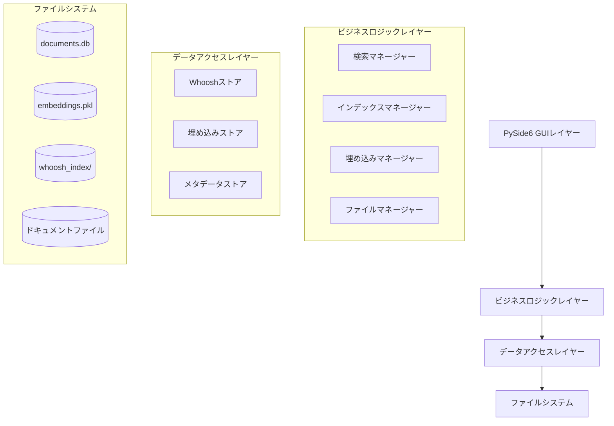

# 設計書

## 概要

DocMindは、Python 3.11-3.13とPySide6で構築されたローカルAI駆動ドキュメント検索アプリケーションです。このシステムは、Whooshを使用した従来のフルテキスト検索と、sentence-transformersによるセマンティック検索機能を組み合わせ、完全にオフラインで動作します。アーキテクチャは、完全なローカル機能を維持しながら、将来のAPIベースAIサービスへの拡張性をサポートするように設計されています。

アプリケーションは、モジュラーで階層化されたアーキテクチャに従い、データアクセス、ビジネスロジック、プレゼンテーション層の間の明確な分離を確保しています。この設計により、保守性が確保され、PoCから本番環境への移行時に簡単な拡張が可能になります。

## アーキテクチャ

### 高レベルアーキテクチャ



### コンポーネントアーキテクチャ

システムは以下の主要コンポーネントに編成されています：

1. **GUIレイヤー**: PySide6ベースの三パネルインターフェース
2. **検索エンジン**: フルテキストとセマンティック検索を組み合わせたハイブリッド検索
3. **ドキュメントプロセッサー**: マルチフォーマットドキュメントテキスト抽出
4. **インデックスマネージャー**: インクリメンタル更新を含むWhooshベースのフルテキストインデックス作成
5. **埋め込みマネージャー**: セマンティック検索用のローカルsentence-transformers
6. **データストレージ**: メタデータ用SQLite、埋め込み用pickle、テキストインデックス用Whoosh

## コンポーネントとインターフェース

### コアクラス

#### SearchManager
```python
class SearchManager:
    """フルテキストとセマンティック検索を組み合わせたハイブリッド検索を調整"""
    
    def __init__(self, index_manager: IndexManager, embedding_manager: EmbeddingManager)
    def search(self, query: str, search_type: SearchType) -> List[SearchResult]
    def hybrid_search(self, query: str, weights: Dict[str, float]) -> List[SearchResult]
    def get_search_suggestions(self, partial_query: str) -> List[str]
```

#### IndexManager
```python
class IndexManager:
    """Whooshフルテキスト検索インデックスを管理"""
    
    def __init__(self, index_path: str)
    def create_index(self) -> None
    def add_document(self, doc: Document) -> None
    def update_document(self, doc: Document) -> None
    def remove_document(self, doc_id: str) -> None
    def search_text(self, query: str, limit: int = 100) -> List[SearchResult]
    def rebuild_index(self, documents: List[Document]) -> None
```

#### EmbeddingManager
```python
class EmbeddingManager:
    """セマンティック検索用のsentence-transformers埋め込みを管理"""
    
    def __init__(self, model_name: str = "all-MiniLM-L6-v2")
    def load_model(self) -> None
    def generate_embedding(self, text: str) -> np.ndarray
    def search_similar(self, query_embedding: np.ndarray, limit: int = 100) -> List[SearchResult]
    def add_document_embedding(self, doc_id: str, text: str) -> None
    def save_embeddings(self) -> None
    def load_embeddings(self) -> None
```

#### DocumentProcessor
```python
class DocumentProcessor:
    """様々なファイル形式からのテキスト抽出を処理"""
    
    def process_file(self, file_path: str) -> Document
    def extract_pdf_text(self, file_path: str) -> str
    def extract_word_text(self, file_path: str) -> str
    def extract_excel_text(self, file_path: str) -> str
    def extract_markdown_text(self, file_path: str) -> str
    def extract_text_file(self, file_path: str) -> str
```

#### FileWatcher
```python
class FileWatcher:
    """インクリメンタルインデックス作成用のファイルシステム変更を監視"""
    
    def __init__(self, watched_paths: List[str], callback: Callable)
    def start_watching(self) -> None
    def stop_watching(self) -> None
    def on_file_created(self, file_path: str) -> None
    def on_file_modified(self, file_path: str) -> None
    def on_file_deleted(self, file_path: str) -> None
```

### GUIコンポーネント

#### MainWindow
```python
class MainWindow(QMainWindow):
    """三パネルレイアウトを含むメインアプリケーションウィンドウ"""
    
    def __init__(self)
    def setup_ui(self) -> None
    def setup_menu_bar(self) -> None
    def setup_status_bar(self) -> None
    def on_search_requested(self, query: str) -> None
    def on_folder_selected(self, path: str) -> None
```

#### FolderTreeWidget
```python
class FolderTreeWidget(QTreeWidget):
    """左パネルフォルダナビゲーション"""
    
    def __init__(self)
    def load_folder_structure(self, root_path: str) -> None
    def on_folder_selected(self, item: QTreeWidgetItem) -> None
```

#### SearchResultsWidget
```python
class SearchResultsWidget(QListWidget):
    """中央パネル検索結果表示"""
    
    def __init__(self)
    def display_results(self, results: List[SearchResult]) -> None
    def create_result_item(self, result: SearchResult) -> QListWidgetItem
    def on_result_selected(self, result: SearchResult) -> None
```

#### PreviewWidget
```python
class PreviewWidget(QTextEdit):
    """右パネルドキュメントプレビュー"""
    
    def __init__(self)
    def display_document(self, document: Document) -> None
    def display_summary(self, text: str) -> None
    def highlight_search_terms(self, terms: List[str]) -> None
```

## データモデル

### コアデータ構造

#### Document
```python
@dataclass
class Document:
    id: str
    file_path: str
    title: str
    content: str
    file_type: str
    size: int
    created_date: datetime
    modified_date: datetime
    indexed_date: datetime
    metadata: Dict[str, Any]
```

#### SearchResult
```python
@dataclass
class SearchResult:
    document: Document
    score: float
    search_type: SearchType
    snippet: str
    highlighted_terms: List[str]
    relevance_explanation: str
```

#### SearchType
```python
class SearchType(Enum):
    FULL_TEXT = "full_text"
    SEMANTIC = "semantic"
    HYBRID = "hybrid"
```

### データベーススキーマ

#### documents.db (SQLite)
```sql
CREATE TABLE documents (
    id TEXT PRIMARY KEY,
    file_path TEXT UNIQUE NOT NULL,
    title TEXT NOT NULL,
    file_type TEXT NOT NULL,
    size INTEGER NOT NULL,
    created_date TIMESTAMP NOT NULL,
    modified_date TIMESTAMP NOT NULL,
    indexed_date TIMESTAMP NOT NULL,
    content_hash TEXT NOT NULL,
    metadata TEXT -- JSON文字列
);

CREATE TABLE search_history (
    id INTEGER PRIMARY KEY AUTOINCREMENT,
    query TEXT NOT NULL,
    search_type TEXT NOT NULL,
    timestamp TIMESTAMP DEFAULT CURRENT_TIMESTAMP,
    result_count INTEGER
);

CREATE INDEX idx_documents_path ON documents(file_path);
CREATE INDEX idx_documents_type ON documents(file_type);
CREATE INDEX idx_documents_modified ON documents(modified_date);
```

### ファイルストレージ構造
```
docmind_data/
├── documents.db           # メタデータ用SQLiteデータベース
├── embeddings.pkl         # ピクルされた埋め込みキャッシュ
├── whoosh_index/          # Whooshフルテキスト検索インデックス
│   ├── _MAIN_*.toc
│   ├── _MAIN_*.seg
│   └── ...
├── models/                # キャッシュされたsentence-transformersモデル
│   └── all-MiniLM-L6-v2/
└── logs/                  # アプリケーションログ
    └── docmind.log
```

## エラーハンドリング

### 例外階層
```python
class DocMindException(Exception):
    """DocMindアプリケーションの基本例外"""
    pass

class DocumentProcessingError(DocMindException):
    """ドキュメント処理が失敗した場合に発生"""
    pass

class IndexingError(DocMindException):
    """インデックス作成操作が失敗した場合に発生"""
    pass

class SearchError(DocMindException):
    """検索操作が失敗した場合に発生"""
    pass

class EmbeddingError(DocMindException):
    """埋め込み操作が失敗した場合に発生"""
    pass
```

### エラーハンドリング戦略

1. **適切な劣化**: セマンティック検索が失敗した場合、フルテキスト検索にフォールバック
2. **部分処理**: 1つのファイルが失敗した場合、他のファイルの処理を継続
3. **ユーザーフィードバック**: UIに意味のあるエラーメッセージを表示
4. **ログ記録**: デバッグとモニタリング用の包括的なログ記録
5. **回復**: 一時的な失敗用の自動再試行メカニズム

### ログ設定
```python
import logging

logging.basicConfig(
    level=logging.INFO,
    format='%(asctime)s - %(name)s - %(levelname)s - %(message)s',
    handlers=[
        logging.FileHandler('docmind_data/logs/docmind.log'),
        logging.StreamHandler()
    ]
)
```

## テスト戦略

### ユニットテスト
- **ドキュメント処理**: 各ファイル形式のテキスト抽出をテスト
- **検索機能**: フルテキストとセマンティック検索の精度をテスト
- **インデックス管理**: インクリメンタルインデックス作成と更新をテスト
- **埋め込み生成**: 埋め込みの一貫性と類似性計算をテスト

### 統合テスト
- **エンドツーエンド検索**: クエリから結果までの完全な検索ワークフローをテスト
- **ファイルシステム統合**: ファイル監視とインクリメンタル更新をテスト
- **データベース操作**: データ永続化と取得をテスト
- **GUI統合**: UI応答性とデータフローをテスト

### パフォーマンステスト
- **検索パフォーマンス**: 50,000ドキュメントで5秒以内の検索時間を検証
- **メモリ使用量**: 大規模操作中のメモリ消費を監視
- **起動時間**: アプリケーションが10秒以内に起動することを確保
- **並行操作**: バックグラウンド処理中のUI応答性をテスト

### テストデータ戦略
```python
# テストドキュメントコレクション構造
test_documents/
├── pdfs/           # 様々なサイズのサンプルPDFファイル
├── word_docs/      # サンプルWordドキュメント
├── excel_files/    # サンプルExcelスプレッドシート
├── markdown/       # サンプルMarkdownファイル
├── text_files/     # サンプルテキストファイル
└── mixed/          # 統合テスト用の混合フォーマットコレクション
```

## 将来の拡張(PoC → 本番環境)

### API統合準備
1. **抽象検索インターフェース**: プラグ可能な検索プロバイダーの作成
2. **設定管理**: APIキーとエンドポイントのサポート
3. **ハイブリッド処理**: ローカルとクラウドベースAI処理の組み合わせ
4. **キャッシュ戦略**: APIレスポンス用のインテリジェントキャッシュ

### パフォーマンス最適化
1. **分散処理**: マルチプロセスドキュメント処理
2. **高度なキャッシュ**: 頻繁にアクセスされるドキュメント用のLRUキャッシュ
3. **データベース最適化**: クエリ最適化とインデックス戦略
4. **メモリ管理**: 大規模ドキュメント用のストリーミング処理

### 拡張機能
1. **高度な検索演算子**: ブールクエリ、フィールド固有検索
2. **ドキュメントクラスタリング**: 類似ドキュメントの自動グループ化
3. **検索分析**: 検索パターンの追跡と最適化
4. **エクスポート機能**: 検索結果とドキュメントコレクションのエクスポート

### セキュリティ強化
1. **データ暗号化**: 機密ドキュメントコンテンツの暗号化
2. **アクセス制御**: ユーザーベースのアクセス制限
3. **監査ログ**: ドキュメントアクセス用の包括的な監査トレイル
4. **プライバシー制御**: 設定可能なデータ保持ポリシー

### スケーラビリティ改善
1. **データベース移行**: 大規模データセット用にSQLiteからPostgreSQLに移行
2. **マイクロサービスアーキテクチャ**: 独立したサービスへの分割
3. **コンテナ展開**: Dockerベースの展開戦略
4. **クラウド統合**: クラウドストレージバックエンドのサポート

