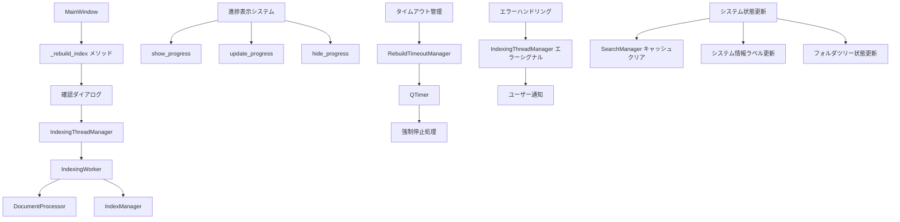
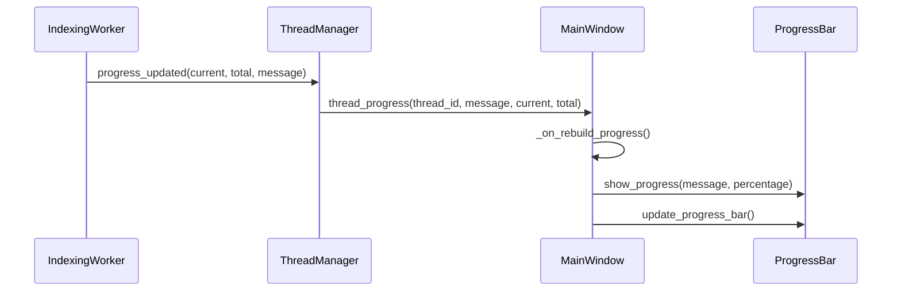

# インデックス再構築機能 技術ドキュメント

## 概要

このドキュメントは、DocMindアプリケーションのインデックス再構築機能の技術的な実装詳細を説明します。開発者向けの詳細な情報を提供し、機能の拡張やメンテナンスに必要な知識を含みます。

## アーキテクチャ概要

### システム構成



### 主要コンポーネント

#### 1. MainWindow（メインウィンドウ）
- **役割**: UI制御とコンポーネント間の調整
- **ファイル**: `src/gui/main_window.py`
- **主要メソッド**:
  - `_rebuild_index()`: インデックス再構築の開始
  - `_on_rebuild_progress()`: 進捗更新の処理
  - `_on_rebuild_completed()`: 完了処理
  - `_on_rebuild_error()`: エラー処理
  - `_handle_rebuild_timeout()`: タイムアウト処理

#### 2. IndexingThreadManager（スレッド管理）
- **役割**: バックグラウンドスレッドの管理
- **ファイル**: `src/core/thread_manager.py`
- **機能**:
  - 最大同時実行数の制御
  - スレッドライフサイクル管理
  - 進捗シグナルの中継

#### 3. RebuildTimeoutManager（タイムアウト管理）
- **役割**: 長時間実行処理のタイムアウト監視
- **ファイル**: `src/core/rebuild_timeout_manager.py`
- **機能**:
  - 30分タイムアウトの監視
  - タイムアウト発生時のシグナル送信
  - 複数スレッドの同時監視

#### 4. IndexingWorker（インデックス処理）
- **役割**: 実際のドキュメント処理とインデックス作成
- **ファイル**: `src/core/indexing_worker.py`
- **機能**:
  - ファイルスキャン
  - ドキュメント処理
  - インデックス更新

## 実装詳細

### 1. インデックス再構築フロー

```python
def _rebuild_index(self) -> None:
    """
    インデックス再構築のメインフロー

    1. 確認ダイアログの表示
    2. フォルダ選択の検証
    3. 既存インデックスのクリア
    4. スレッド開始
    5. タイムアウト監視開始
    6. 進捗表示開始
    """
    try:
        # 1. ユーザー確認
        if not self._show_rebuild_confirmation_dialog():
            return

        # 2. フォルダ検証
        current_folder = self.folder_tree_container.get_selected_folder()
        if not current_folder:
            self._show_folder_not_selected_dialog()
            return

        # 3. インデックスクリア
        self.index_manager.clear_index()

        # 4. スレッド開始
        thread_id = self.thread_manager.start_indexing_thread(
            folder_path=current_folder,
            document_processor=self.document_processor,
            index_manager=self.index_manager
        )

        if thread_id:
            # 5. タイムアウト監視開始
            self.timeout_manager.start_timeout(thread_id)

            # 6. 進捗表示開始
            self.show_progress("インデックスを再構築中...", 0)

    except Exception as e:
        self._handle_rebuild_error(str(e))
```

### 2. 進捗管理システム

#### 進捗更新フロー



#### 進捗表示の実装

```python
def _on_rebuild_progress(self, thread_id: str, message: str, current: int, total: int) -> None:
    """
    インデックス再構築専用の進捗更新処理

    Args:
        thread_id: スレッドID
        message: 進捗メッセージ
        current: 現在の処理数
        total: 総処理数
    """
    # 進捗率の計算
    percentage = int((current / total) * 100) if total > 0 else 0

    # 段階別メッセージの生成
    stage_message = self._get_stage_message(message, current, total)

    # 進捗表示の更新
    self.show_progress(stage_message, percentage, current, total)

    # 詳細ログの記録
    self.log_rebuild_progress(thread_id, current, total, message)
```

### 3. タイムアウト管理

#### RebuildTimeoutManagerの実装

```python
class RebuildTimeoutManager(QObject):
    """インデックス再構築のタイムアウト管理"""

    timeout_occurred = Signal(str)  # thread_id

    def __init__(self, timeout_minutes: int = 30, parent=None):
        super().__init__(parent)
        self.timeout_minutes = timeout_minutes
        self.active_timers: Dict[str, QTimer] = {}

    def start_timeout(self, thread_id: str) -> None:
        """タイムアウト監視を開始"""
        if thread_id in self.active_timers:
            self.cancel_timeout(thread_id)

        timer = QTimer(self)
        timer.setSingleShot(True)
        timer.timeout.connect(lambda: self._handle_timeout(thread_id))
        timer.start(self.timeout_minutes * 60 * 1000)  # ミリ秒に変換

        self.active_timers[thread_id] = timer

    def _handle_timeout(self, thread_id: str) -> None:
        """タイムアウト発生時の処理"""
        if thread_id in self.active_timers:
            del self.active_timers[thread_id]

        self.timeout_occurred.emit(thread_id)
```

### 4. エラーハンドリング

#### エラー分類と処理

```python
def _on_rebuild_error(self, thread_id: str, error_message: str) -> None:
    """
    インデックス再構築エラー時の処理

    エラータイプの判定と適切な処理を行う
    """
    # エラータイプの判定
    error_type = self._classify_error(error_message)

    # タイムアウト監視のキャンセル
    self.timeout_manager.cancel_timeout(thread_id)

    # エラータイプ別の処理
    if error_type == "file_access":
        self._handle_file_access_error(thread_id, error_message)
    elif error_type == "system":
        self._handle_system_error(thread_id, error_message)
    elif error_type == "timeout":
        # タイムアウトは別途処理済み
        return
    else:
        self._handle_unknown_error(thread_id, error_message)

    # 共通のクリーンアップ処理
    self._cleanup_after_error(thread_id)
```

### 5. システム状態管理

#### 完了時の状態更新

```python
def _on_rebuild_completed(self, thread_id: str, statistics: dict) -> None:
    """
    インデックス再構築完了時の処理

    Args:
        thread_id: 完了したスレッドのID
        statistics: 処理統計情報
    """
    try:
        # 1. タイムアウト監視のキャンセル
        self.timeout_manager.cancel_timeout(thread_id)

        # 2. 検索キャッシュのクリア（要件5.3）
        self.search_manager.clear_suggestion_cache()

        # 3. システム情報の更新（要件5.1）
        self._update_system_info_after_rebuild(statistics)

        # 4. フォルダツリーの状態更新（要件5.4）
        self._update_folder_tree_status()

        # 5. 進捗表示の完了
        completion_message = self._generate_completion_message(statistics)
        self.hide_progress(completion_message)

        # 6. 完了ログの記録
        self.log_rebuild_operation("COMPLETED", thread_id, **statistics)

    except Exception as e:
        self.logger.error(f"完了処理でエラー: {e}")
```

## データ構造

### 1. 再構築状態管理

```python
@dataclass
class RebuildState:
    """インデックス再構築の状態管理"""
    thread_id: Optional[str] = None
    start_time: Optional[datetime] = None
    folder_path: Optional[str] = None
    is_active: bool = False
    timeout_timer: Optional[QTimer] = None

    def is_timeout_exceeded(self, timeout_minutes: int = 30) -> bool:
        """タイムアウトを超過しているかチェック"""
        if not self.start_time:
            return False
        elapsed = datetime.now() - self.start_time
        return elapsed.total_seconds() > (timeout_minutes * 60)
```

### 2. 進捗情報

```python
@dataclass
class RebuildProgress:
    """再構築進捗情報"""
    stage: str  # "scanning", "processing", "indexing", "completed"
    current_file: str
    files_processed: int
    total_files: int
    percentage: int
    message: str

    def get_display_message(self) -> str:
        """表示用メッセージを生成"""
        if self.stage == "scanning":
            return f"ファイルをスキャン中... ({self.total_files}個発見)"
        elif self.stage == "processing":
            return f"処理中: {os.path.basename(self.current_file)} ({self.files_processed}/{self.total_files})"
        elif self.stage == "indexing":
            return f"インデックスを作成中... ({self.files_processed}ファイル処理済み)"
        else:
            return self.message
```

## シグナル・スロット設計

### 主要シグナル接続

```python
def _connect_rebuild_signals(self) -> None:
    """再構築関連のシグナルを接続"""

    # ThreadManagerのシグナル
    self.thread_manager.thread_progress.connect(self._on_rebuild_progress)
    self.thread_manager.thread_finished.connect(self._on_rebuild_completed)
    self.thread_manager.thread_error.connect(self._on_rebuild_error)

    # タイムアウトマネージャーのシグナル
    self.timeout_manager.timeout_occurred.connect(self._handle_rebuild_timeout)

    # フォルダツリーのシグナル
    self.folder_tree_container.folder_selected.connect(self._on_folder_selected)
    self.folder_tree_container.refresh_requested.connect(self._on_folder_refresh)
```

## パフォーマンス最適化

### 1. メモリ管理

```python
class IndexingWorker(QThread):
    """メモリ効率的なインデックス処理"""

    def __init__(self, batch_size: int = 100):
        super().__init__()
        self.batch_size = batch_size
        self.processed_count = 0

    def process_documents_in_batches(self, documents: List[str]) -> None:
        """バッチ処理によるメモリ使用量の制御"""
        for i in range(0, len(documents), self.batch_size):
            batch = documents[i:i + self.batch_size]
            self._process_batch(batch)

            # メモリクリーンアップ
            if self.processed_count % (self.batch_size * 10) == 0:
                self._cleanup_memory()
```

### 2. インデックス最適化

```python
def optimize_index_after_rebuild(self) -> None:
    """再構築後のインデックス最適化"""
    try:
        # Whooshインデックスの最適化
        with self.index_manager.get_writer() as writer:
            writer.optimize()

        # 埋め込みキャッシュの最適化
        self.embedding_manager.optimize_cache()

        # 不要なファイルのクリーンアップ
        self._cleanup_temporary_files()

    except Exception as e:
        self.logger.warning(f"インデックス最適化でエラー: {e}")
```

## テスト戦略

### 1. 単体テスト

```python
class TestIndexRebuild(unittest.TestCase):
    """インデックス再構築の単体テスト"""

    def test_rebuild_confirmation_dialog(self):
        """確認ダイアログのテスト"""
        # モックダイアログでユーザー応答をシミュレート

    def test_timeout_detection(self):
        """タイムアウト検出のテスト"""
        # タイムアウト条件をシミュレート

    def test_error_handling(self):
        """エラーハンドリングのテスト"""
        # 各種エラー条件をテスト
```

### 2. 統合テスト

```python
class TestIndexRebuildIntegration(unittest.TestCase):
    """インデックス再構築の統合テスト"""

    def test_full_rebuild_workflow(self):
        """完全な再構築ワークフローのテスト"""
        # 実際のファイルを使用した統合テスト

    def test_large_scale_performance(self):
        """大規模データでのパフォーマンステスト"""
        # 1000+ファイルでの性能テスト
```

## ログ設計

### 1. ログレベル

- **DEBUG**: 詳細な進捗情報、内部状態
- **INFO**: 操作開始/完了、重要な状態変更
- **WARNING**: 回復可能なエラー、タイムアウト
- **ERROR**: 処理失敗、システムエラー
- **CRITICAL**: 回復不可能なエラー

### 2. ログフォーマット

```python
# メインログ
'%(asctime)s - %(name)s - %(levelname)s - [%(funcName)s:%(lineno)d] - %(message)s'

# 再構築専用ログ
'🔧 REBUILD [操作] | Thread: thread_id | 詳細情報'
'📊 PROGRESS [thread_id] current/total (percentage%) | メッセージ'
'❌ ERROR [thread_id] Type: error_type | Message: error_message'
'⏰ TIMEOUT [thread_id] Duration: 30分 | 詳細情報'
```

## セキュリティ考慮事項

### 1. ファイルアクセス制御

```python
def safe_file_access(self, file_path: str) -> bool:
    """安全なファイルアクセスチェック"""
    try:
        # パスインジェクション攻撃の防止
        normalized_path = os.path.normpath(file_path)
        if not normalized_path.startswith(self.allowed_base_path):
            raise SecurityError("不正なファイルパス")

        # アクセス権限の確認
        if not os.access(normalized_path, os.R_OK):
            raise PermissionError("ファイル読み取り権限なし")

        return True

    except Exception as e:
        self.logger.warning(f"ファイルアクセスチェック失敗: {e}")
        return False
```

### 2. リソース制限

```python
class ResourceLimiter:
    """リソース使用量の制限"""

    def __init__(self, max_memory_mb: int = 1024, max_files: int = 10000):
        self.max_memory_mb = max_memory_mb
        self.max_files = max_files

    def check_memory_usage(self) -> bool:
        """メモリ使用量のチェック"""
        import psutil
        process = psutil.Process()
        memory_mb = process.memory_info().rss / 1024 / 1024
        return memory_mb < self.max_memory_mb

    def check_file_count(self, file_count: int) -> bool:
        """ファイル数の制限チェック"""
        return file_count < self.max_files
```

## 拡張ポイント

### 1. カスタムプロセッサーの追加

```python
class CustomDocumentProcessor(DocumentProcessor):
    """カスタムドキュメントプロセッサー"""

    def register_custom_handler(self, extension: str, handler: Callable):
        """カスタムファイルハンドラーの登録"""
        self.custom_handlers[extension] = handler

    def process_custom_format(self, file_path: str) -> str:
        """カスタム形式の処理"""
        extension = os.path.splitext(file_path)[1].lower()
        if extension in self.custom_handlers:
            return self.custom_handlers[extension](file_path)
        return super().process_document(file_path)
```

### 2. 進捗通知の拡張

```python
class ProgressNotifier:
    """進捗通知の拡張"""

    def __init__(self):
        self.notification_handlers = []

    def add_notification_handler(self, handler: Callable):
        """通知ハンドラーの追加"""
        self.notification_handlers.append(handler)

    def notify_progress(self, progress_info: RebuildProgress):
        """進捗通知の送信"""
        for handler in self.notification_handlers:
            try:
                handler(progress_info)
            except Exception as e:
                self.logger.warning(f"通知ハンドラーエラー: {e}")
```

## 今後の改善点

### 1. 短期的改善

- **並列処理の最適化**: CPUコア数に応じた並列度の調整
- **進捗表示の改善**: より詳細な進捗情報の提供
- **エラー回復の強化**: 部分的な処理継続機能

### 2. 長期的改善

- **増分インデックス**: 変更されたファイルのみの処理
- **分散処理**: 複数マシンでの分散インデックス作成
- **クラウド統合**: クラウドストレージとの連携

## 関連ドキュメント

- [設計書](design.md): 詳細な設計仕様
- [要件定義書](requirements.md): 機能要件と受入基準
- [ユーザーマニュアル](index_rebuild_user_manual.md): エンドユーザー向けガイド
- [API仕様書](api_specification.md): 内部API仕様
